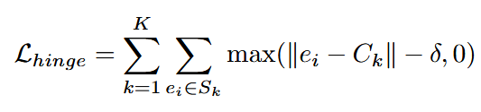
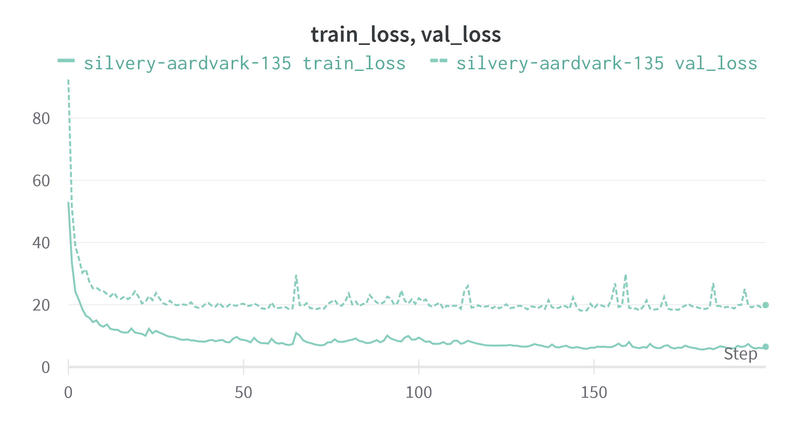
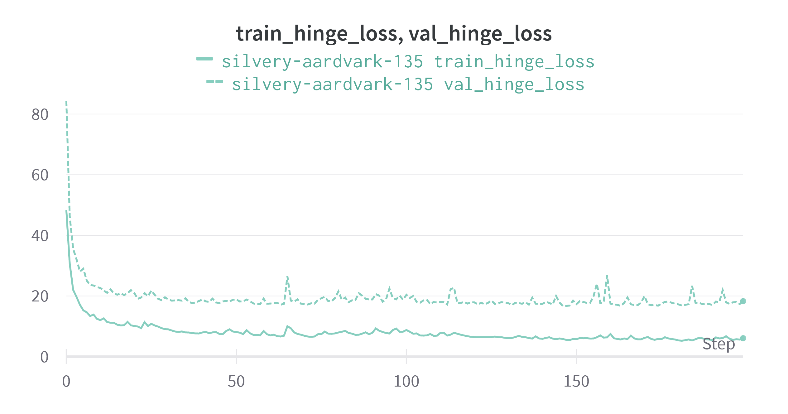
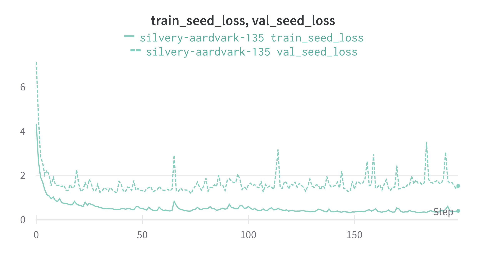
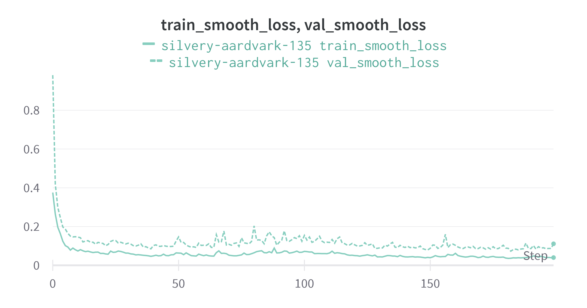
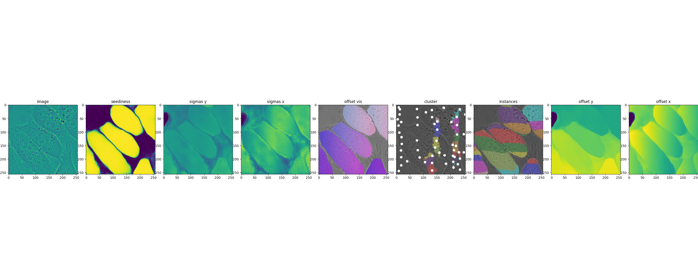

# PA228 Semestral project - Cell instance segmentation

This is a report detailing the implementation of my semestral project for the **PA228** course.
It is divided into logical sections as follows:
1. Project introduction - in this section I introduce the method I chose to implement.
2. Implementation - the main part of this report, it is further divided into subsections: *Data preparation*, *Model definition*, *Loss function*, *Training*, *Miscellaneous*
3. Closing thoughts - in this section I lay down a few comments about the project

## Project introduction
I chose to implement the method **EmbedSeg** as described in the paper *Embedding-based Instance Segmentation in
Microscopy* (https://arxiv.org/abs/2101.10033).

The method is based on predicting offset vectors that push pixels of each cell instance towards its center (in this paper the center is represented by the medoid so as to guarantee that it lies inside the instance).
Post-processing step consists of clustering close pixels and labeling those by identical instance label.

In addition to the offset vectors, a *seediness* map and *sigma* (clustering bandwith) map are also predicted. The *seediness* map is essentially a map of probabilities, specifying whether a particular pixel is a cell pixel.
To correctly cluster pixels of instance of various sizes (as is the case with cells), we also predict *sigma* map, that specifies the clustering bandwith that should be used for the instance that the pixel belongs to.

### Related work
There is another work similar to this one, and that is the *EmbedTrack -- Simultaneous Cell Segmentation and Tracking Through Learning Offsets and Clustering Bandwidths* (https://arxiv.org/abs/2204.10713), which
in addition to instance segmentation performs tracking as well, by predicting frame to frame offsets.

Both of these works are actually based on the paper *Instance Segmentation by Jointly Optimizing Spatial Embeddings and Clustering Bandwidth* (https://arxiv.org/abs/1906.11109),
so that was my first place to go to understand the method.

## Implementation
This section provides my commentary on the implementation phase of my project.

### Data preparation
#### Computing instance centers
To train the network to learn to predict offsets to push instance pixel towards the instance center, annotations 
denoting the centers for instances are needed. The routine that generates the annotations is implemented in the file *embed_seg_impl/data_processing/compute_instance_centers.py*.
The script takes in one argument that specifies a path to a CTC dataset. Inside the dataset, for every sequence and every reference annotation type (ST/GT) it generates the
annotations in the folder *INSTANCE_CENTERS*. So the dataset tree will look like:

```
├── DIC-C2DH-HeLa/
│   │── 01/
│   │   │── t001.tif
│   │   └── ...
│   │── 01_GT/
│   │   │── SEG/
│   │   │   │── man_seg001.tif
│   │   │   └── ...
│   │   │── INSTANCE_CENTERS/
│   │   │   │── man_seg001.tif
│   │   │   └── ...
│   │── 01_ST/
│   │   │── SEG/
│   │   │   │── man_seg001.tif
│   │   │   └── ...
│   │   │── INSTANCE_CENTERS/
│   │   │   │── man_seg001.tif
│   │   │   └── ...
.   .   .
.   .   .
.   .   .
```

As instance centers, medoids of instance pixels are computed to ensure that the center always lies within the instance
regions. As the computation of the exact medoid is quite time consuming, I opted for approximate medoid by computing medoid
of a subset of instance region pixels. The subset is taken randomly by sampling the instance region pixels `count` number of times (without replacement)
, where `count` is 25% from the number of pixels of the instance region.

#### Generating crops
The training is not done on entire images, rather on crops of the original data. Each crop is centered on the center
of an instance. Therefore, for every sample in the original dataset, we can generate multiple crops.
The script that generates these crops is located in the file `embed_seg_impl/data_processing/generate_train_data.py`.
It takes as argument a path to a dataset with computed **INSTANCE_CENTERS** annotations and a `--crop_size` argument (single integer)
specifying the size of crops to generate. The script stores the crops in the folder `TRAIN_CROPS_256x256` in the dataset folder.
The final dataset tree will look like this:

```
├── DIC-C2DH-HeLa/
│   │── 01/                 # as before
│   │── 01_GT/              # as before
│   │── 01_ST/              # as before
│   │── 02/                 # as before
│   │── 02_GT/              # as before
│   │── 02_ST/              # as before
│   │── TRAIN_CROPS_256x256
│   │   │── 01/
│   │   │   │── t001_7.tif  # crop from t001.tif centered on the instance 7
│   │   │   └── ...
│   │   │── 01_SEG/
│   │   │   │── man_seg001_7.tif  # crop from the instance annotation man_seg001.tif centered on the instance 7
│   │   │   └── ...
│   │   │── 01_INSTANCE_CENTERS/
│   │   │   │── man_seg001_7.tif  # crop from the centers annotation man_seg001.tif centered on the instance 7
│   │   │   └── ...
│   │   │── 02/
│   │   │   │── *similarly*
│   │   │   └── ...
│   │   │── 02_SEG/
│   │   │   │── *similarly*
│   │   │   └── ...
│   │   │── 02_INSTANCE_CENTERS/
│   │   │   │── *similarly*
│   │   │   └── ...
```


### Model definition
The phase of model definition was quite straightforward, I just had to follow the paper *ERFNet: Efficient Residual Factorized ConvNet for Real-Time Semantic Segmentation* (https://ieeexplore.ieee.org/document/8063438)
where the architecture is detailed and have the output branched out - two decoders, one for predicting the seediness map
and one decoder for predicting the offsets and sigmas. Otherwise, these two decoders share the encoder part of the model.


### Loss function
This part was absolutely crucial to the implementation. 
 
The loss function is composed of three losses:
*L_instance* that is responsible for penalizing offsets that do not move relevant pixels towards their instance center
*L_seed* responsible for penalizing the incorrect probability that a pixel is a cell or not
*L_var* responsible for making sure that sigmas for the same instance are as close in value to each other as possible

Early on, when I was actually primarily following the original paper that **EmbedSeg** is based on, I most likely did not understand
the wording in the paper and chose a wrong function for *L_instance*.
For *L_instance* I chose **hinge loss** in the form:


Where *e_i* is the pixel after shifting it with the predicted offset, *C_k* is the center of the instance that the pixel
belongs to and *delta* is margin and it is a function of the predicted sigma values for that instance.
In this setting, the model would just learn that the easiest is to predict large sigma, for every pixel, essentially
merging all pixel into a single instance. Long story short, after thouroughly rereading the paper and the **EmbedSeg** paper
I used the *Lovász hinge* loss (https://arxiv.org/abs/1705.08790) (got the implementation from https://github.com/bermanmaxim/LovaszSoftmax).

### Training
For configuration and comfortable customization of training parameters I used the *Hydra* framework (https://github.com/facebookresearch/hydra).

For logging and visualization purposes I used the *Weights & Biases* platform (https://wandb.ai/).
I logged both training and validation losses, but also the constituent losses: *L_instance*, *L_var*, *L_seed* to see in more detail
how the training is progressing or stagnating. In addition, every few epochs (e.g., 5) I visualized the predictions on a random sample from the validation set:
1. the seediness map
2. the sigmas map
3. the offsets map - colored by matching the angles to the *Hue* wheel of the *HSV* color model and matching the magnitudes to the *Saturation*
4. individual *x* and *y* channels of the offsets map
5. clustered pixels
6. instances after the post-processing step






Visualized predictions:


And in this visualization we can see a problem:
I could not get the network to learn to predict suitable y-offsets. If you look at the visualization of the y and x channels of
the offsets map, you can see, that the x-channel ahs positive and negative values at the left and right extremes inside
instance regions, corresponding to the desired 'squishing' effect of pixels in the horizontal direction.
In the y channel we do not see such a thing, instead it looks like the values are kind of monotonically increasing as the
row number increases as well. And that corresponds to the 'banding' effect on the `instance` visualization, where
every instance is divided into horizontal bands.

I looked meticulously at my implementation of the loss function yet I was not successful (as a last resort I peeked at the loss function
 implemented by the **EmbedSeg** authors, but could not really find any stark differences). I also examined whether by some mistake I was sending
incorrect annotations for the instance center, but it does not seem so.

### Miscellaneous
This part only details some more things that are implemented in the project.
- `embed_seg_impl/post_processing.py` contains the code to cluster the embedded pixels into instances.
- `embed_seg_impl/visualize.py` contains a few visualization functions